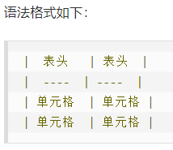
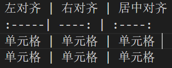

## 一些写作心得？

之前用过一段时间的typora收费了，搞得我头疼的vscode，让我又不得不弃，幸好找到office viewer的扩展，瞬间好用了起来TAT,可以直接粘贴图片，还是相对路径的。

## 标题

一级标题

\========*在下*

二级标题

\---------*在下*

or

\# 一级标题

\###### 六级标题

```
# 假一级标题（看来在这里是作为文章名或者就是大字体也可导航
## 一级标题
### 二级标题到六级
###### 五级标题
# 假一级标题2
```

俩空格

## 回车空一行才是换行

也可以行结尾多加两个以上空格

## *斜体*:

\*斜体*
\_斜体_

## **粗体**:

\**粗体**

## ***粗斜体***

\***粗斜体***

---

## 分割线

\***

\* * *

\******

\- - -

\----------

## ~~删除线~~:\~~删除线~~

## `<u>`下划线 `</u>`:\<u>下划线\</u>

*Notice：对错误的忽略挺好*原来下划线右少\也就忽略

## [^脚注]

创建脚注格式类似这样 [^RUNOOB]。

## 代码块

这里好像只能 \```能复制的```\`函数名（不能复制）`

`printf()`

```
<?php
echo 'runoob'
function test(){
echo 'test'
}
```

## 这是表格加测试配合snipaste

| 表头   | 表头   |
| ------ | ------ |
| 单元格 | 单元格 |
| 单元格 | 单元格 |


经比较，能看到比实际截的图要大大概1/4……

\!\[pic1 pic](../pic/Snipaste_2022-08-16office.png "插入第一张图，第一次相对路径输入对了还调了好一会才出来……")

| 左对齐 | 右对齐 | 居中对齐 |
| :----- | -----: | :------: |
| 单元格 | 单元格 |  单元格  |
| 单元格 | 单元格 |  单元格  |



图片的一起写了吧

还有跟那个链接一样的，\[pic3]\[1]\[1]:网图链接

> Markdown 还没有办法指定图片的高度与宽度，如果你需要的话，你可以使用普通的 \ 标签
> \

> hugo官方文档的：不太懂怎么搞的，回头有空看看（主要感觉能用一个就行了
> {{ $image := resources.Get "images/screenshot.png" }}

## 这是一个链接

[菜鸟教程](https://www.runoob.com)\[菜鸟教程](https://www.runoob.com)
or[https://www.runoob.com](https://www.runoob.com)\<https://www.runoob.com>

这个链接用 1 作为网址变量 [Google][1]  \[Google]\[1]

这个链接用 runoob 作为网址变量 [Runoob][runoob]
然后在文档的结尾为变量赋值（网址）

\[1]: http://www.google.com/
\[runoob]: http://www.runoob.com/

## 高级玩法（huwlihushao

# 支持的 HTML 元素

不在 Markdown 涵盖范围之内的标签，都可以直接在文档里面用 HTML 撰写。

```
目前支持的 HTML 元素有：<kbd> <b> <i> <em> <sup> <sub> <br>等 ，如：

使用 <kbd>Ctrl</kbd>+<kbd>Alt</kbd>+<kbd>Del</kbd> 重启电脑
```

使用 `<kbd>`Ctrl `</kbd>`+`<kbd>`Alt `</kbd>`+`<kbd>`Del `</kbd>` 重启电脑,再俺这没啥效果，不用（也记不住咳咳

# 转义 \

Markdown 支持以下这些符号前面加上反斜杠来帮助插入普通的符号：

```
\   反斜线
`   反引号
*   星号
_   下划线
{}  花括号
[]  方括号
()  小括号
#   井字号
+   加号
-   减号
.   英文句点
!   感叹号
```

# [数学公式](https://io-oi.me/tech/documentation-of-hugo-theme-meme/#katexmathjaxmermaid)（应该不用吧……

# Hugo官方的[Diagrams](https://gohugo.io/content-management/diagrams/#goat-diagrams-ascii)

[1]: http://www.google.com/
[runoob]: http://www.runoob.com/
[^RUNOOB]: 菜鸟教程 -- 学的不仅是技术，更是梦想！！！
