# 汉王N510刷入OpenInkpot系统

# 心血来潮

几年前在咸鱼60块吧，收了个n510，试试电纸书。果然后来大部分时间是在吃灰，不过也有原生系统挺拉的缘故。后来也闲着想把这个屏幕拆开来玩玩，百度上搜了下，没找到什么好的中文资料，就摆了。这几天也是一时在bing上随手一搜，就找到了https://luojia.me/5479/](https://luojia.me/5479/) 这个大佬的拆机贴，一看原来还有这第三方OI系统。果断决定刷个机玩玩，结果就连踩好几个坑……

# 刷机步骤

## 查找资料

**其实说起来也很简单，跟着现成的教程来就完了，但是，找资料，复现老环境也花了不少功夫。24年了，这台08年的设备在国内互联网上的水花基本没多少了，汉王官网上都没有什么踪影了。这也让我有点感觉物是人非。好在OI后面还有个存档下载站，还有webarchive保存的12年的部分OI原官方网站。**

**一开始看部分资料是N510和516部分可以通刷，先是纠结了N510和516有什么区别，我看了下516可能支持音频播放和录音，其他的基本一样。后面看上面的博主展示的图，发现跟手上的机子一模一样，于是放心继续刷了。**

**基本上从**[OpenInkpot (archive.org)](https://web.archive.org/web/20131206122859/http://openinkpot.org/wiki) 这里找就可以了，[Index of /pub/ (openinkpot.org)](https://openinkpot.org/pub/) 就是仅存的存档下载站了。

## 刷驱动

**后面就是为Jz4740-USB-Boot-Device刷驱动，这块连踩几个坑。**

**驱动安装所需INF和SYS文件都包含在**[https://openinkpot.org/pub/contrib/n516-usbboot/azbooka-usbboot-new.tar.gz](https://openinkpot.org/pub/contrib/n516-usbboot/azbooka-usbboot-new.tar.gz) ，应该说有USB_Boot.exe的都有。一开始接触还不知道INF怎么装，实际上右键就有安装选项。

**接下来就是win10这么些年更新的强制驱动安装数字签名，我按网上各种临时禁用的方法（其实也就看到两种）试了，再来提示成功。可是设备管理器还是找不到驱动。我又手动添加，跳出来个只支持64位驱动安装提示。我不死心还试了几次，果不其然失败了。**

**我重新看了遍安装包内的readme：Usb_Boot_Driver.sys: the driver file used for Windows 2000/XP/Vista。好么，这么老的系统才行。我还犹记得之前win11更新，有人用骚操作成功调制解调器连上网，也是为了兼容性吧，可轮到我正好被抛下。**

**那就装个XP的虚拟机来刷机，也不是什么大不了的。网上一搜镜像，不用迅雷下电驴的纯净包（MSDN I TELL YOU），其他的都是ghost，我寻思就刷个机用用，谁下的快用谁呗。不过第三方实在有点没眼看，还是下了纯净版（实际上是熬夜到昏头了，忘了搜下ghost转换iso）。从之前安装的禁用恶意软件证书阻止了迅雷的安装，到100k/s的百毒云，到偷懒API下载卡在99%不动的阿里云，最后还是登录阿里转存客户端下载。几分钟后终于开始装XP。后面都很顺畅了，照着几个教程，轻松搞定。这时候有点修仙脑抽了。想起酷安老哥的告诫，不要在晚上刷机……**

**安装完XP，直接顺手把vmtool装了，把上面解压出的文件夹拖到XP虚拟机。右键安装INF，连接设备（先关机，再按住横屏键和电源键3秒等灯微亮），成功识别。后面就是照猫画虎地敲命令，进行初次的刷机。**

## 刷机

**这里要下载** `flashimage`的包，解压后在 `n516-usbboot`文件夹里运行 `USB_Boot.exe`。

> **机翻readme步骤：**
>
> **1.通过USB连接设备。**
> **2.按着“旋转”按钮，打开设备电源。**
> **3.新设备将出现在您的系统中，找驱动程序指向此目录。**
> **4.运行USB Boot.exe **
> **5.在USBboot shell中执行命令:**
> **	**> boot 0 **
> **	**> fconfig USBboot.cfg 0**
> **	**如果一切正常，将出现以下提示信息:**
> **USBboot:> boot 0
>
> ** Booting No.0 device......UnBooted.....Boot success!**
> ** Initing No.0 device......Init Configration success!**
> ** USBBoot :> fconfig USBboot.cfg 0**
>
> ** Configing No.0 device....**
> ** Init Configration success!**
> ** USBBoot :>**
>
> **6.执行下一步命令:**
> **	**> nerase 0 4096 0 0 **
> **	**> nprog 0 n516-image.bin 0 0 -n**
>
> **7.当刷机完成时，复位设备（戳背后RESET小孔）。它应该启动到新的固件。如果刷机是成功的，屏幕应该闪烁几次，引导将显示。**

刷机中如下图：

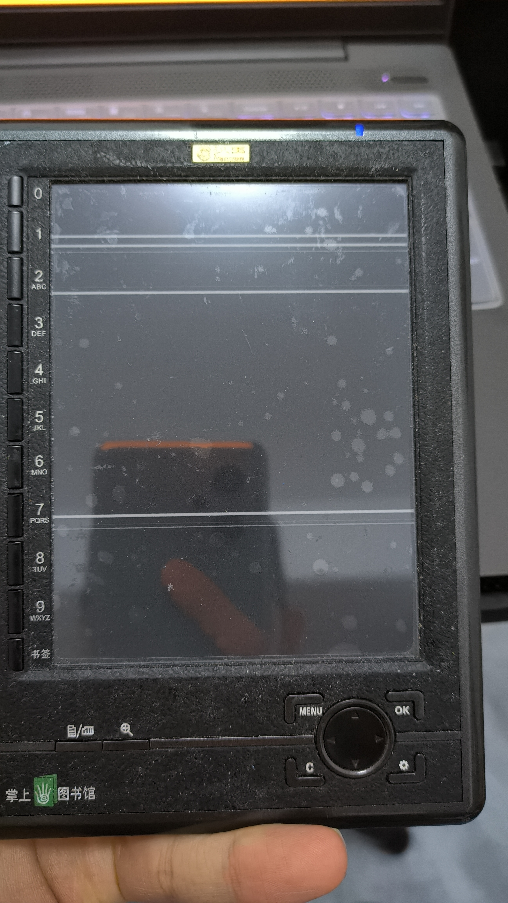

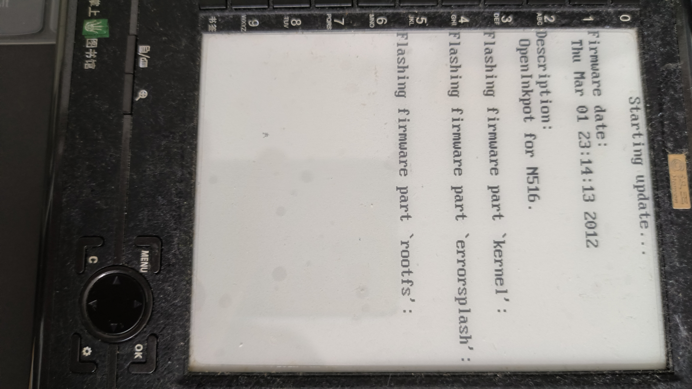

**后面要更新什么的，直接把** `update`、`reinstall`包解压出的oifw文件放在sd卡根目录下重新开次机即可。如果中间变砖了，重头按初次刷机来应该就行。

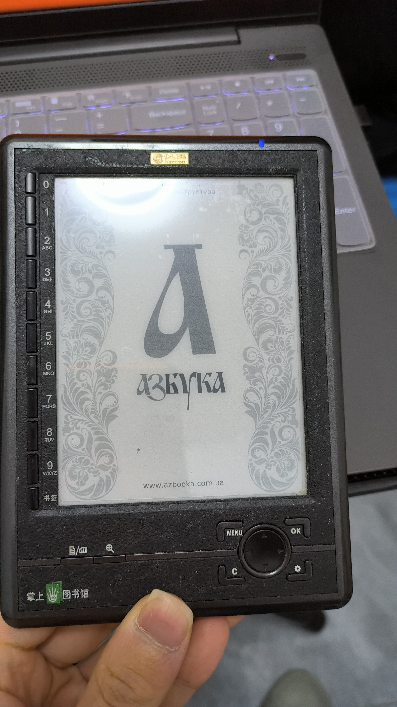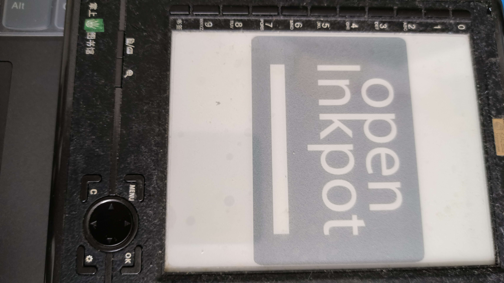

**这边有两款系统azbooka和单纯的OI。前者UI感觉上更加美观，不过只有英俄乌三语可选。后者则多达十几种，不过也导致了后面出现中文字体缺字的问题，某个bug导致的中文字符集无法被正确导入，只能使用日文字符集。打开中文文本更是连片框框。**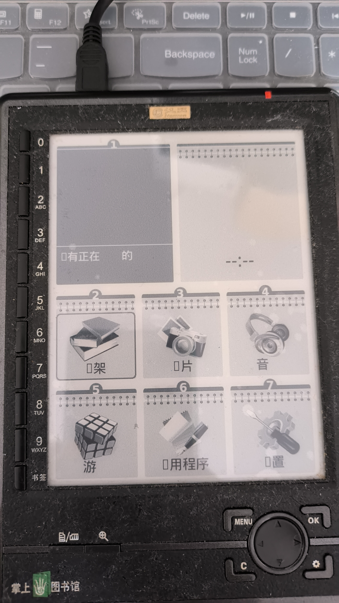

**好在这个问题可以通过在SD卡根目录下创建.fonts文件夹，放入自己下载的中文字体来解决（这样，在开机后会白屏半小时以上，应该是在读取字体吧）。然后就可以得到完整的中文体验了（才怪，其实基本上的界面都汉化了，但是种种提示帮助可还是纯英文）。**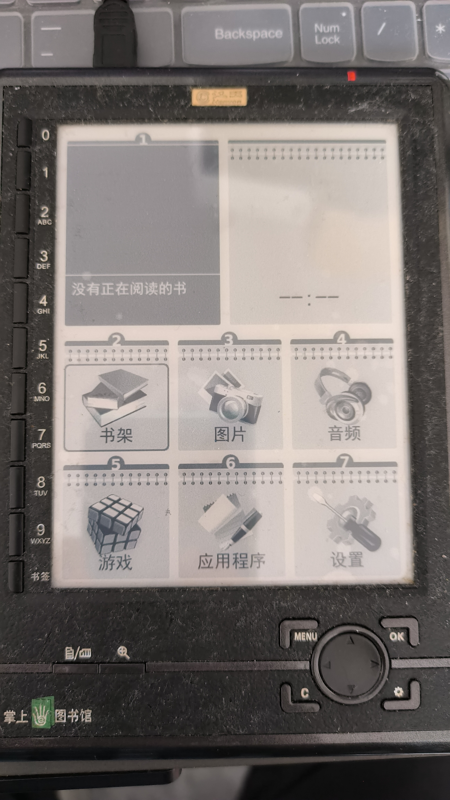

**还有一些小问题，前者通过电源键关机要反应好几分钟，两者互刷update包会有字体上的一些问题等**

**不过用来看书也是够了，OI系统通过软件算法实现了动态刷新界面，灰阶也得到了升级。就是比原生系统页面响应快了（也许有那么半秒？），画面更加细腻了。其他的比如阅读界面上UI调整也有很大自由度。**

# 进阶

**可以通过USB数据线RNDIS联网，SSH连接整活？原想删除一些用不到的看看能不能运行更流程。寄了，根本连不上。设备描述符就出错，Windows、Ubuntu都识别不了……可能这设备也太老了吧。**

# 使用体验

**作为我上手的第一款电纸书，体验上其实还可以， 屏幕大概5寸，正好适合放入口袋随身（也正因为这个，屏幕给磕了一个小黑点。不过也是原来的保护套都掉皮了丢了……）单手握持也很趁手。去掉屏幕上的保护膜，也能看起来更加通透。皮质外壳部分因为老化有点粘灰，只能用酒精擦干净，用久了还是粘不少毛毛。**

**原来系统确实鸡肋，显示效果还是OI后面好点，虽然也有一些残影的问题。**

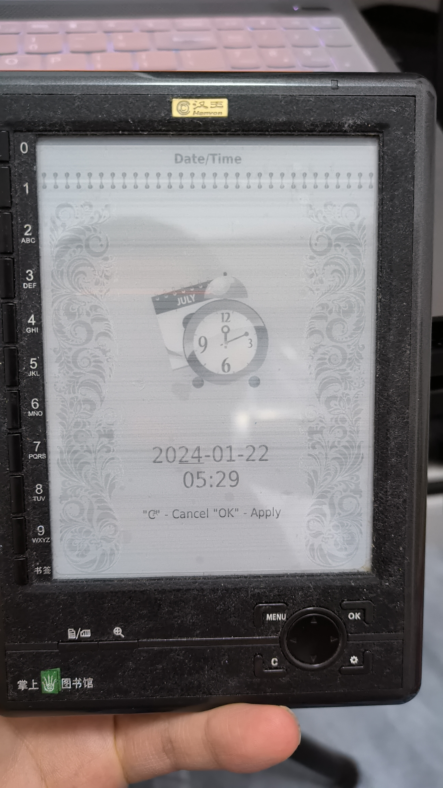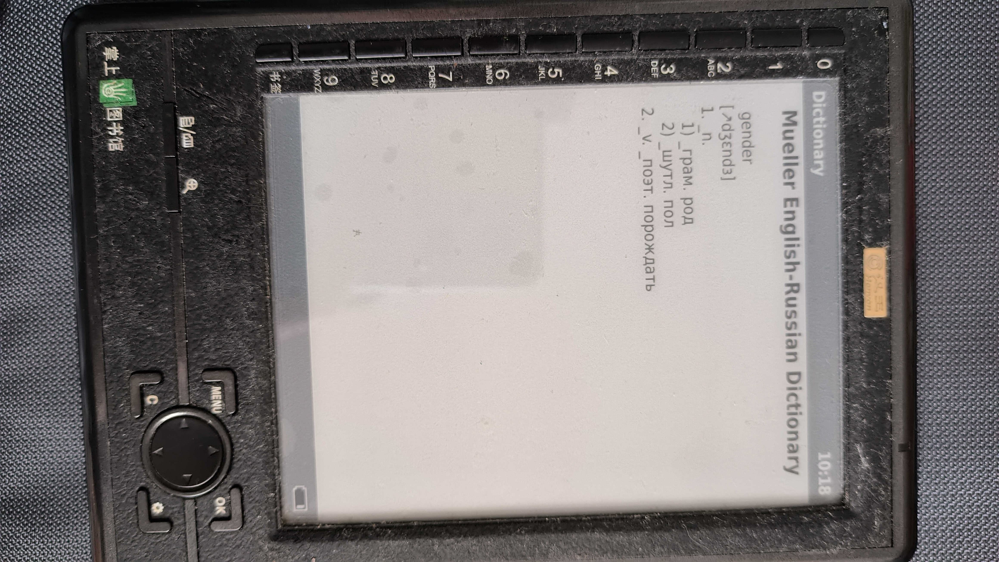

**功能丰富性上提高了不少，看书、图片、益智棋类游戏、音乐录音、俄英词典、看时间都可。不过我这个构建有点问题，有几个版本的可以插耳机听音乐，目前刷的又不行，不过也不用指望音质。系统卡的时候更是鬼畜……**

**刷机完首先需要做的是添加字体（见上面），这个系统后面出现了中文字符缺失的问题，必须自己添加。这个新添加字符到SD卡后，再开机之后它还会加载个半小时，不太清楚为什么。后面就能直接用了。**

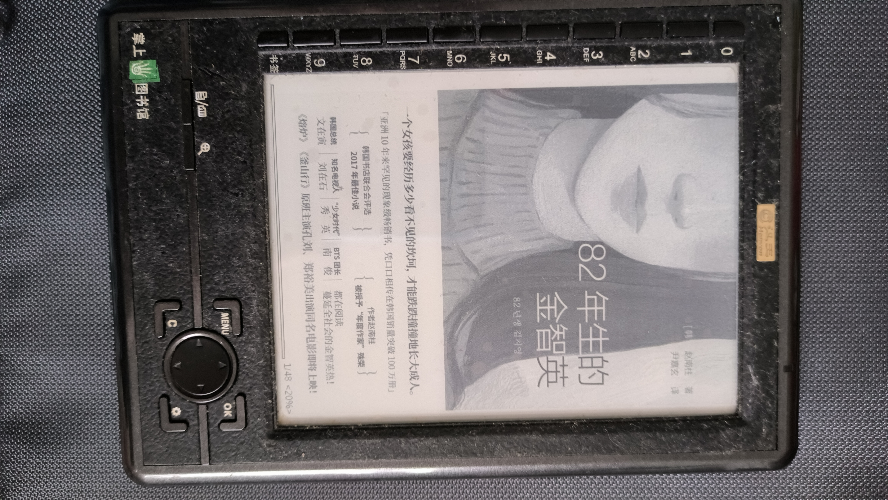

**但就文字图书阅读，翻页速度基本上是优化了，按键即响应，比原来的快得多。但是滚轮似乎太灵敏了，每次多翻挺烦。而且也有操作太快卡死的问题。残影问题也不多见，正常阅读没有，一般是操作太快或者系统负载大可能会有。**

**还有一点，系统自由度挺高，很多设置自己能改。**

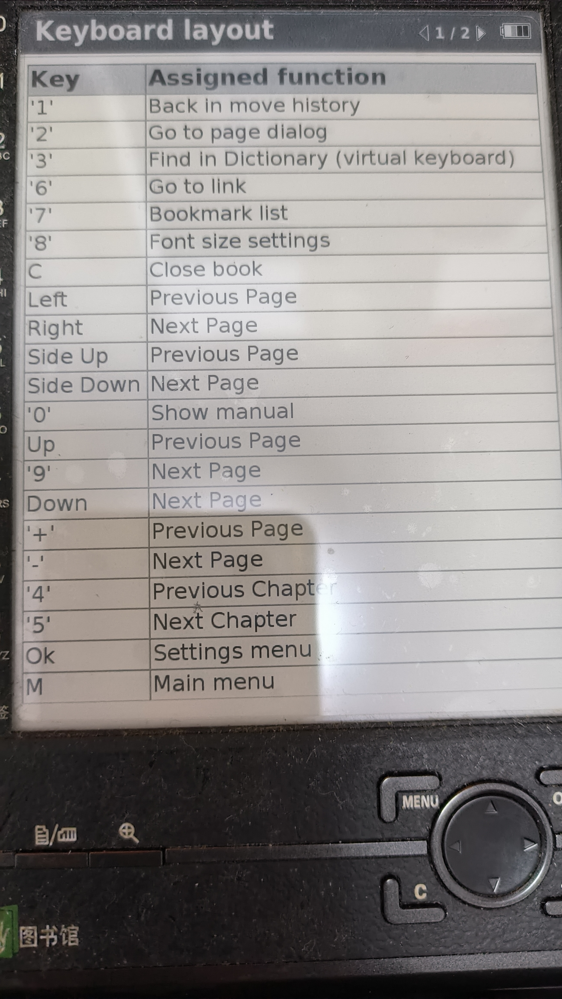

**这个可以做到四种屏幕旋转，自由度确实不错，可以不用死扣一个键了。**

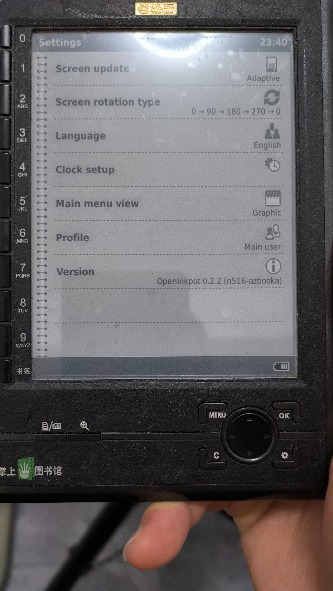

屏幕动态刷新算法带来的灰阶升级比较

**在打开文件方面，测试了几个，基本上常见格式都可以。doc等不行。打开我自制的网文epub，似乎是目录太多了，几百个，会加载好一会，而且一按查看目录就闪退。其他图片比较多的也会卡死。**

**原想SSH连接上删去一些不要的模块，看看能不能减轻设备负担，试了多次也不行。**

# 多图杀猫

折腾的时候拍了不少图，也没什么顺序，就列在下面了。

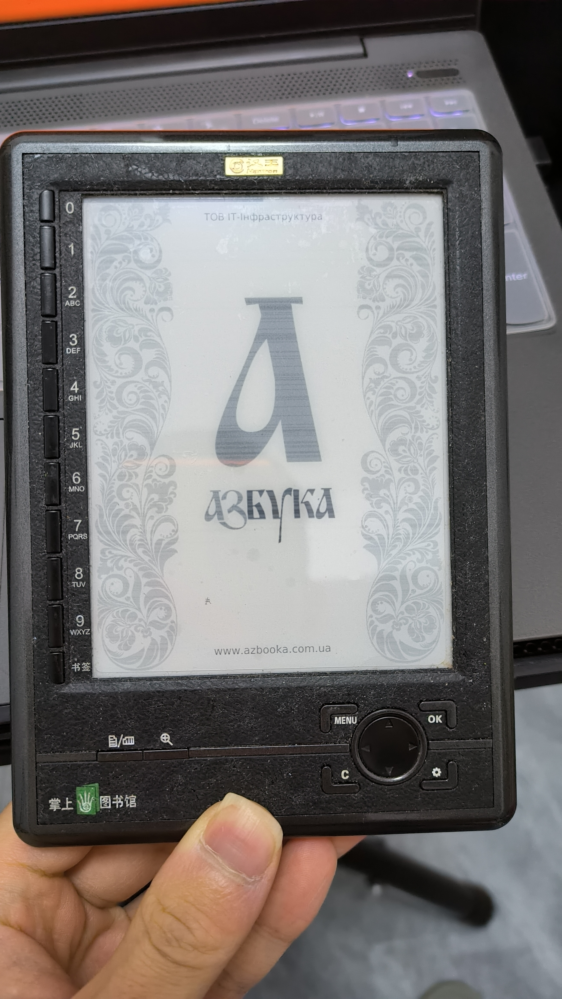

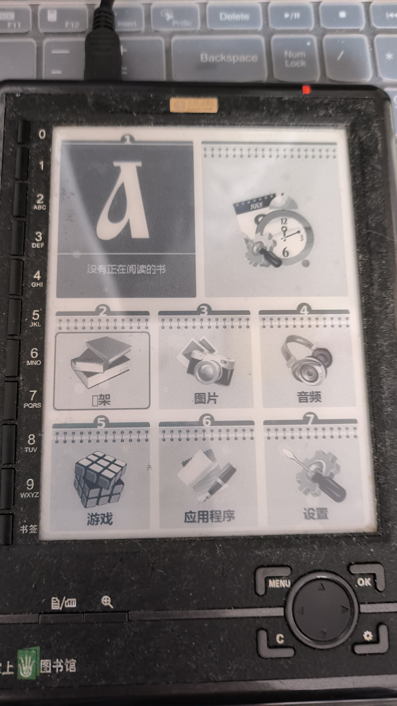

# 后话

**在存档的开发文档页面看到后面要转移至OpenWRT去了，因为维护这么一个单独的系统太复杂。可惜后面还是没了。当时还是太小众了些么。用爱发电不易呀。**

# 存档部分

**保存一下web archive上的部分信息，免得再去找。**

## Supported file formats

### Books

#### Main formats

**Those formats are supported by developers and bugs are fixed ASAP.**

* **ePub12**
* **FB21**
* **HTML, XHTML1**
* **Plain text**
* **RTF**
* **PDF3**
* **DjVu**

#### Secondary formats

**The following file formats are supported to a lesser degree. Bugs related to those formats are not prioritized.**

* **TCR (compressed text for Psion)**
* **Plucker**
* **Open E-Book (OEB)**
* **OpenReader**
* **ztxt (Weasel)**
* **Palmdoc (Aportis)**
* **Mobipocket 2**
* **CHM**

### Images

* **png**
* **jpeg**
* **gif**
* **xpm**

### Music

> **Only for N516.**

* **mp3**
* **ogg**

---

1. 1. **CSS and tables are not fully supported**
2. 2. **Only DRM-free files**
3. 3. **Password-protected PDFs are not supported**

## misc

**相关网页信息：**

[User/Fonts – OpenInkpot (archive.org)](https://web.archive.org/web/20130801074259/http://openinkpot.org/wiki/User/Fonts#manual-installation)

[Roadmap – OpenInkpot (archive.org)](https://web.archive.org/web/20131206131307/http://openinkpot.org/roadmap?show=all)

[#944 (Chinese UI broken in recent builds (Due to font problem)) – OpenInkpot (archive.org)](https://web.archive.org/web/20121010124556/http://openinkpot.org/ticket/944)

[0.2/UsersGuide – OpenInkpot (archive.org)](https://web.archive.org/web/20131206131431/http://openinkpot.org/wiki/0.2/UsersGuide)

[汉王电纸书N510刷机到N516 - 百度文库 (baidu.com)](https://wenku.baidu.com/view/fe81cee95ef7ba0d4a733b1d.html?_wkts_=1705852971685) 启发看到OI
